# 🪔 Mithai Mandir

A full-stack web application for managing a sweet shop. Built with **React (Vite + TypeScript)** on the frontend and **Node.js (Express + Prisma + MySQL)** on the backend.

## Features

- User authentication (Admin & User roles)
- Add to Cart and place orders
- Sweet inventory management
- Admin controls: Orders, Restocks, Inventory
- Responsive and modern UI (Bootstrap)

## Tech Stack

| Layer      | Technology                     |
|------------|--------------------------------|
| Frontend   | React (Vite, TypeScript), Bootstrap |
| Backend    | Node.js, Express, Prisma ORM   |
| Database   | MySQL                          |
| Testing    | Jest, Supertest                |

---

## Project Setup Guide

### Clone the Repository & Navigate to Project Directory

```bash
git clone https://github.com/sanket-164/Sweet-Shop-Management-System.git
cd sweet-shop-management
```

### Backend Setup

1. Navigate to the backend directory

   ```bash
   cd backend
   ```

2. Install backend dependencies

   ```bash
   npm install
   ```

3. Create a `.env` file in the `backend/` directory & Add your MySQL connection string
     ```env
     DATABASE_URL="mysql://<username>:<password>@localhost:3306/sweetshop"
     ```

4. Run the initial migration to create your database schema

     ```bash
     npx prisma migrate dev --name init
     ```

5. Start the backend server

   ```bash
   npm run dev
   ```

6. You can register a new admin by modifying the seed script directly.
   ```bash
   node src/seed.js
    ```
  * Sample Admin Credentials to login
    ```bash
    Email: admin@sweetshop.com
    Password: admin123
    ```

   * Server will run on: `http://localhost:3000`

### Frontend Setup

1. Navigate to the frontend directory

   ```bash
   cd ../frontend
   ```

2. Install frontend dependencies

   ```bash
   npm install
   ```

3. Create environment file for frontend

   ```env
   VITE_BACKEND_URL=http://localhost:3000
   ```

4. Start the React development server

   ```bash
   npm run dev
   ```

   * App will run at: `http://localhost:5173`
---

## ✅ Running Tests

### Navigate to Backend for Unit Tests

```bash
npm run test
```

> Uses `jest` and `supertest` for testing API endpoints and business logic.

### ✅ Test Report Summary

Total Tests: 41 | Passed: 41 | Failed: 0

---

## Screenshots

### Authentication

#### Register Page
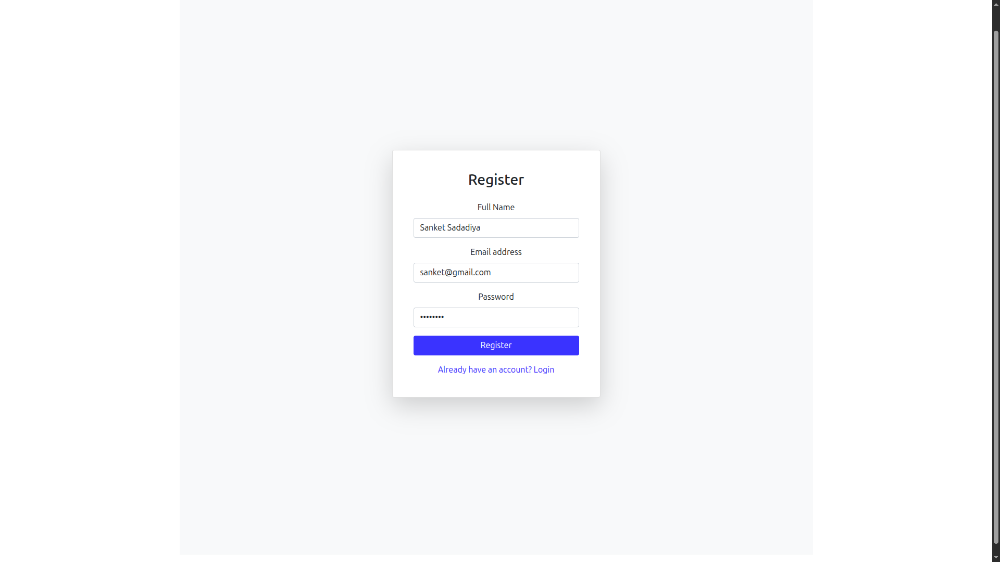

#### Login Page
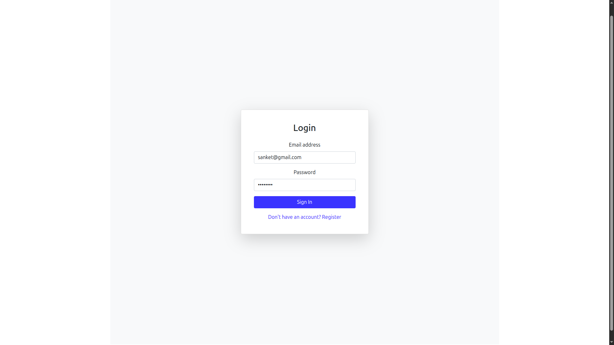

---

### Customer Panel

#### Home Page
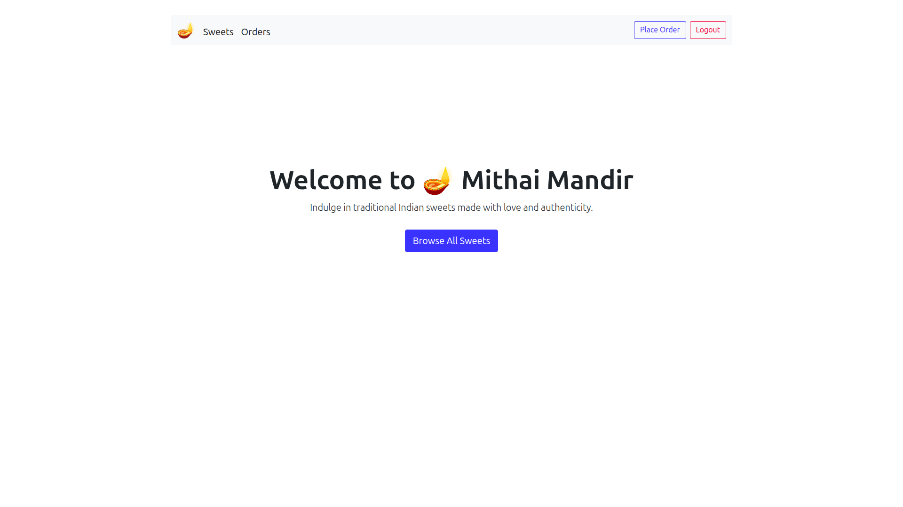

#### Sweets Listing
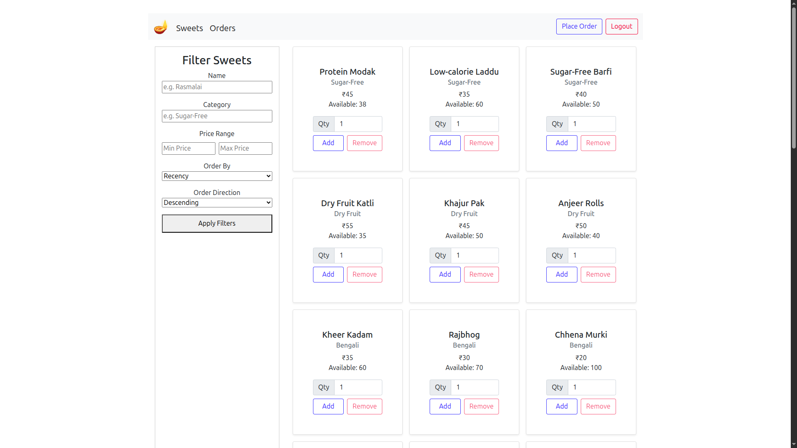

#### Filter Sweets
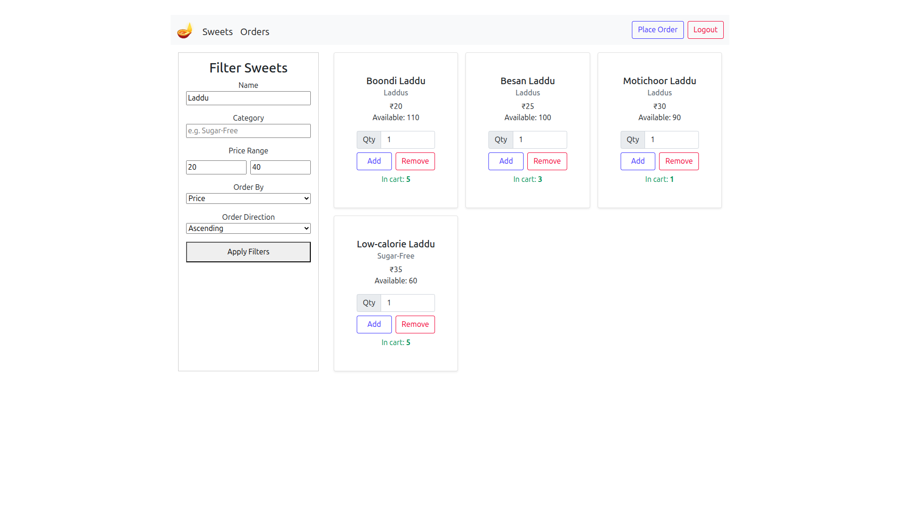

#### Customer Cart
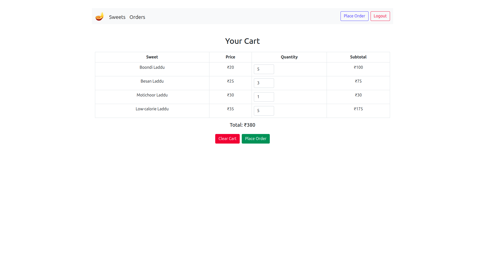

#### Orders Page
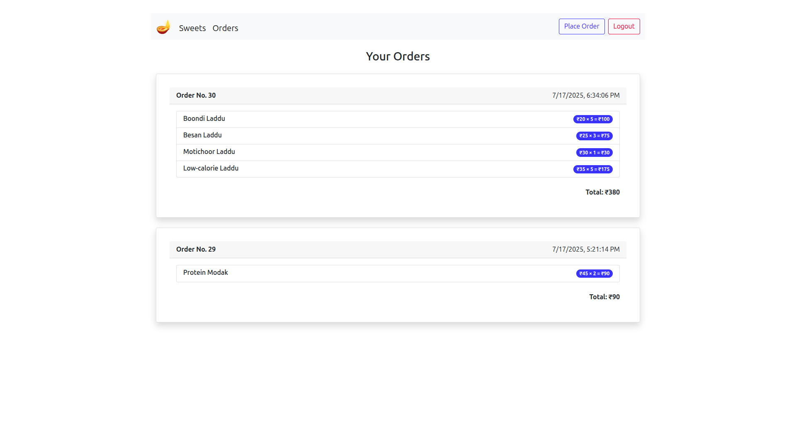

---

### Admin Panel

#### Sweets Listing
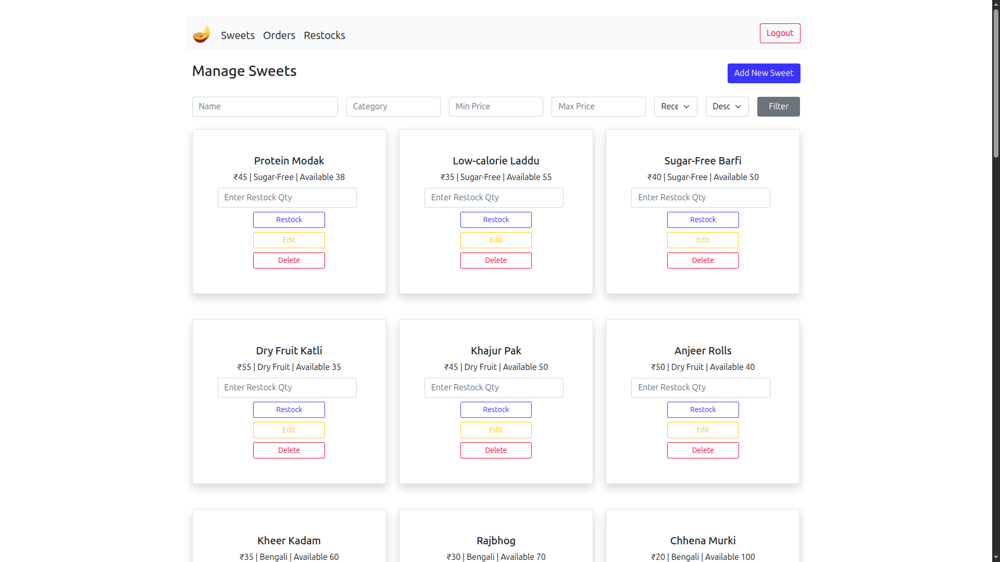

#### Add New Sweet
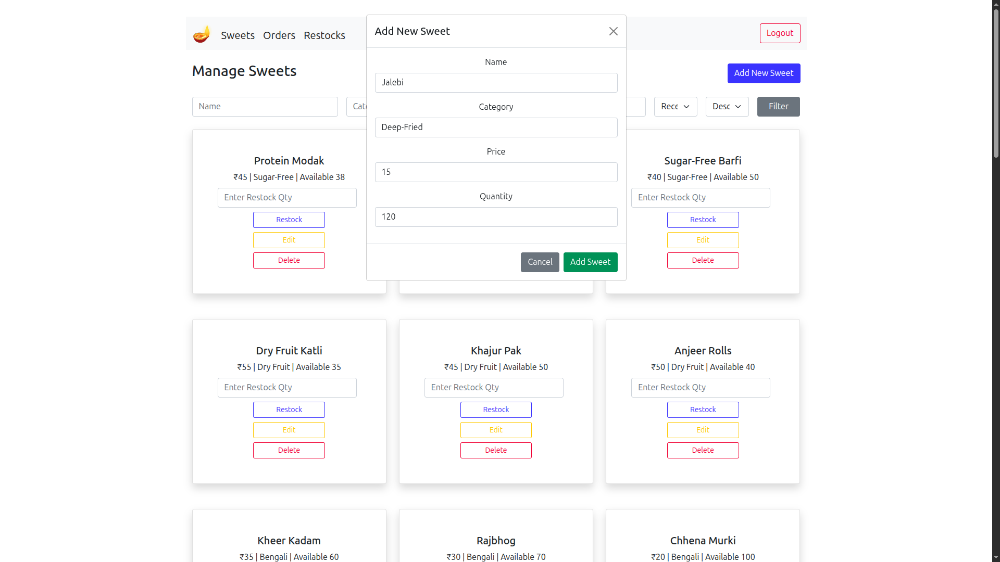

#### Update Sweet Details
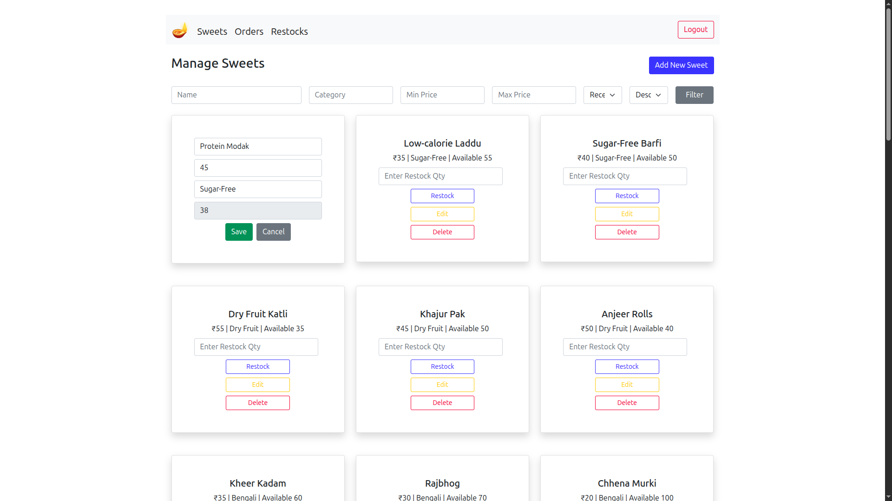

#### Restock Sweets
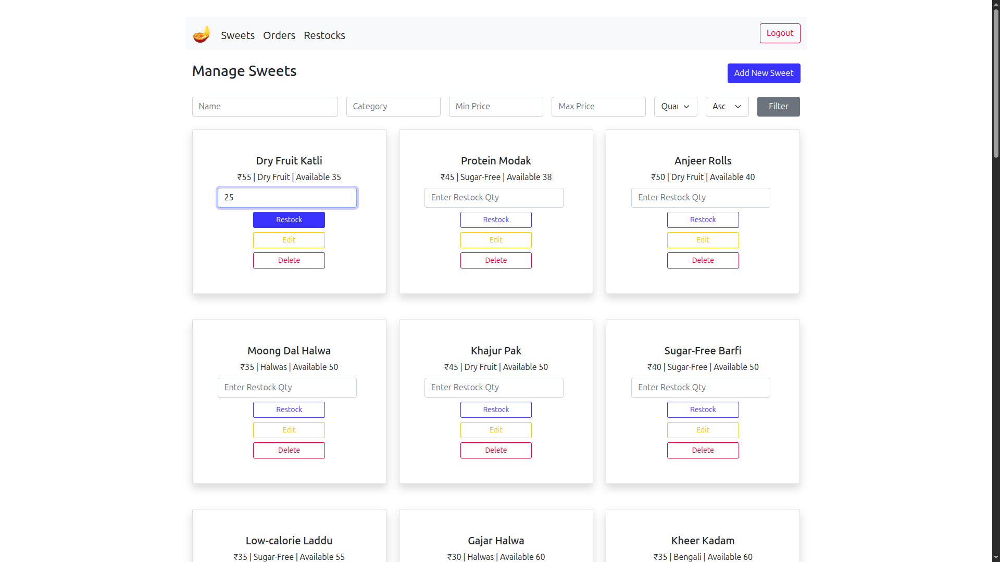
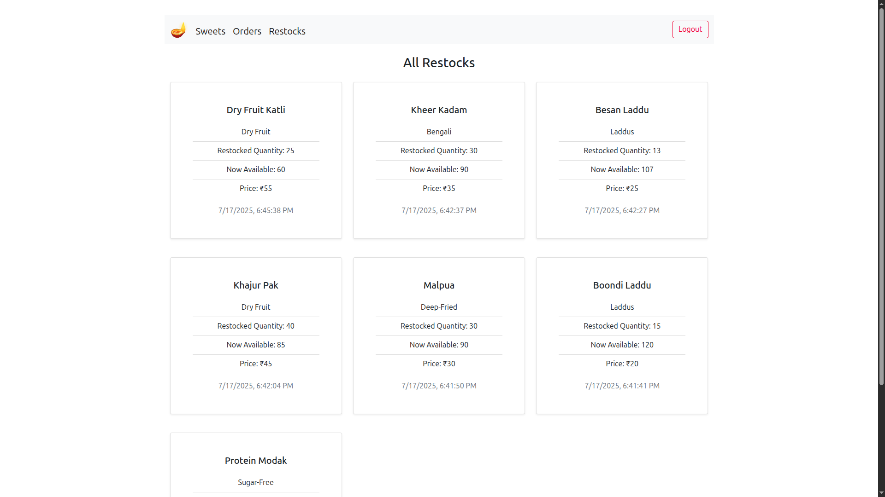

#### Orders
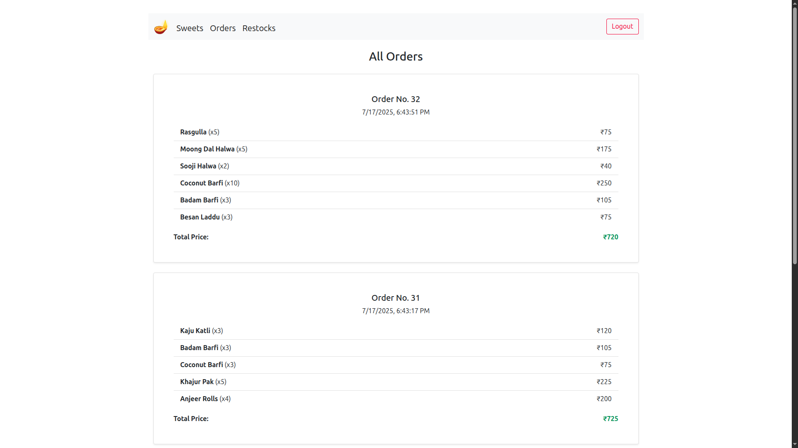

---

## 📃 License

MIT License
